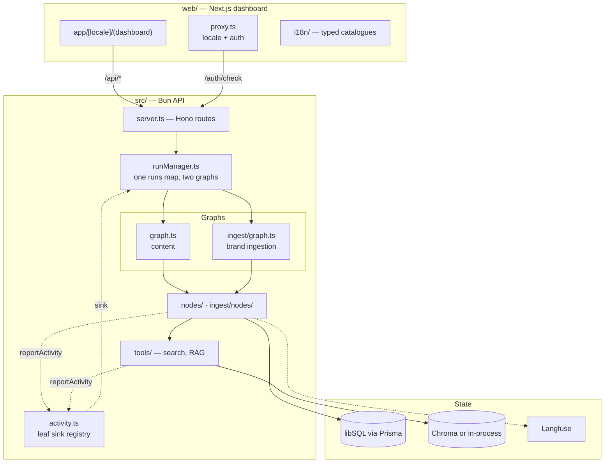
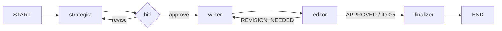
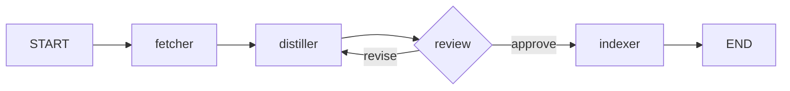

# Architecture

Authoritative description of how this codebase is actually put together. It records what exists, including where the code departs from its own boundaries. Regenerate it after any structural change.

**Last generated:** 2026-08-02

Design rationale lives in `docs/superpowers/specs/`; day-to-day rules and traps live in `CLAUDE.md` and `web/AGENTS.md`. This file does not repeat either — it maps the structure and points at them.

## Overview

Two applications in one repository, each with its own `package.json`, `tsconfig.json` and lint configuration:

| | Root | `web/` |
|---|---|---|
| Runtime | Bun | Node (Next.js 16) |
| Role | LangGraph pipelines, HTTP API, persistence, retrieval | Dashboard UI |
| Entry | `src/server.ts` (Hono), `src/cli.ts` | `web/app/[locale]/` |
| Data access | Prisma + libSQL, Chroma or in-process vectors | none — HTTP only |

They share no code and no database handle. The dashboard reaches the API exclusively through a `/api/*` rewrite (`web/next.config.ts`), which is what keeps the API independently usable with `curl`.

**This is not a layered architecture.** The organising structure is two LangGraph state machines plus the machinery that drives them. Directories map to roles in those graphs, not to Clean Architecture layers, and reading them as layers will mislead you.

## Component structure



## The two graphs

Both compile to a `StateGraph` with a `MemorySaver` checkpointer, and both pause on `interrupt()` for a human.

**Content** (`src/graphBuilder.ts`, compiled in `src/graph.ts`) — prompt chaining into an evaluator–optimizer loop:



**Ingestion** (`src/ingest/graph.ts`) — crawl, distil, review, index:



The writer↔editor loop is capped by `MAX_ITERATIONS` (`src/constants.ts`). **Both human loops are uncapped by design** — the person controls them.

The distiller emits the same triple the hand-written corpus has always had — profile, style guide, exemplars — rendered by `src/ingest/render.ts` into the shape of `data/brand/*.md`. That is why ingestion required no change to retrieval, chunking or either prompt: an ingested brand is indistinguishable from a seeded one downstream.

## Dependency rules

The intended direction is one-way:

```
server.ts / cli.ts → runManager → graph → nodes → tools → (db, vector store)
                                                    ↘ activity.ts (leaf)
```

| Directory | Role | May import | Must not import |
|---|---|---|---|
| `src/routing/` | pure routing and verdict functions | `constants`, `state`, types | anything with I/O |
| `src/nodes/` | content graph steps | `tools`, `prompts`, `db`, `model`, `observability`, `activity` | `runManager`, `server` |
| `src/ingest/nodes/` | ingestion steps | `ingest/*`, `db`, `model`, `activity`, `tools/rag` | `runManager`, `server` |
| `src/ingest/fetchers/` | source adapters | `ingest/extract`, `ingest/safety`, `ingest/types`, `activity` | `db`, `runManager` |
| `src/tools/` | agent-callable tools | `brands`, `activity`, vector backends | `nodes`, `runManager` |
| `src/prompts/` | prompt text and variables | `schemas`, `utils` | anything with I/O beyond Langfuse |
| `src/publishers/` | outbound destination adapters | `constants` | `db`, `nodes`, `runManager` |
| `src/activity.ts` | progress sink registry | **nothing** | everything |

`src/activity.ts` imports nothing at all, and that is load-bearing rather than incidental: tools call `reportActivity`, and a tool importing `runManager` would close the cycle `runManager → graph → nodes → tools → runManager`. Verified: the file has zero import statements.

`src/routing/` holds the pure decisions — `routeAfterEditor` and `deriveVerdict` — so a threshold can be unit-tested without running a graph. `deriveVerdict` exists because asking a model to apply `≥ 0.8` to three numbers produced verdicts contradicting its own scores.

`src/publishers/facebook.ts` calls the Graph API with plain `fetch` while `src/mcp/notion.ts` goes through an MCP server, so the two publishers sit in different directories. That asymmetry is accepted rather than accidental: relocating working Notion code buys tidiness and risks a regression. A third destination is the moment to move Notion into `src/publishers/` and introduce a shared `Publisher` interface — at two, the registry is indirection that makes each publisher harder to read than the flat function it replaces.

### Documented deviation

`src/ingest/*` reaches up into root-level modules: `../../db`, `../../model`, `../../activity`, `../../observability`. The ingestion subsystem is therefore not self-contained — it is a peer of `src/nodes/` that happens to live one directory deeper.

This is deliberate and currently harmless: those four modules sit below everything in the dependency order, so no cycle results. It is recorded here so nobody mistakes `src/ingest/` for a module with a real boundary. Giving it one would mean injecting the database and model at graph construction, which the single-process design does not yet justify.

## Cross-cutting concerns

**Authentication — one implementation.** `src/auth.ts` owns the HMAC session token and constant-time comparison. Hono guards `/runs*`, `/drafts*`, `/brands*`, `/publish*` and `/stats`; `web/proxy.ts` calls `GET /auth/check` rather than re-deriving the HMAC, so the two cannot drift. Unset `DEMO_PASSWORD` makes both sides a no-op.

**Tracing and cost.** `src/observability.ts` builds Langfuse callbacks; `src/costTracker.ts` accumulates tokens as a LangChain callback. Every node's inner `.invoke()` must merge the parent config via `mergeConfigs(config, {...})` — without it, callbacks attached at `graph.stream()` silently never fire, which once made cost tracking report `$0` for every run. See `CLAUDE.md` for the full account.

**Progress.** `src/activity.ts` is a per-thread sink registry. Nodes and tools call `reportActivity`, which logs to stdout and forwards to whichever run owns that thread. It emits as `node: 'activity'`, deliberately outside `NODES`, so it can never mark a pipeline step complete. Reporting is never load-bearing: an unknown thread is a no-op and a throwing sink is swallowed.

**Error reporting.** The API returns a stable code plus English prose — `{ error: 'brand_not_found', message: 'brand not found' }`. `web/lib/errors.ts` translates the code and falls back to the prose, so an unmapped code degrades to readable English. Zod validation responses are exempt: structured and developer-facing.

**Configuration.** Environment variables only, read at their point of use. `src/costTracker.ts` reads prices per call rather than at module load, because module-scope reads froze the rates at whichever import happened first.

## Data architecture

**Relational** — Prisma 7 with `@prisma/adapter-libsql` over a `file:` database on a Fly volume.

- `Brand` → `BrandSource` → `BrandDocument`; `Draft` carries a nullable `brandId` with `onDelete: SetNull`, so deleting a brand keeps draft history.
- `src/db.ts` exposes async functions returning a **snake_case** wire shape. `toDraftRow()` is the single place Prisma's camelCase and `Date` objects meet the API, because `web/lib/types.ts` mirrors those key names by hand.
- `setDraftCost`/`setDraftNotionUrl` use `updateMany`, not `update`: Prisma's `update` throws when no row matches, while the raw SQL they replaced was a silent no-op.
- Migrations are hand-authored with `migrate diff` and applied with `migrate deploy`. **`migrate dev` must never run against real data** — see `CLAUDE.md`. `scripts/deploy-migrations.ts` baselines a pre-Prisma volume before deploying.

**Vector** — one collection per brand, two interchangeable backends behind `lookupBrandStyle(query, brandId, threadId?)`:

| `VECTOR_STORE` | Implementation | Used by |
|---|---|---|
| `chroma` | `@langchain/community` Chroma client | local development |
| `memory` | `src/tools/memoryVectorStore.ts`, cosine over an array | the deployed container |

Only `BrandDocument` rows with `included = true` are embedded. `raw_page` rows are stored with `included = false`: provenance a claim can be traced back to, never retrieved. `corpusHash` lives on the `Brand` row rather than in Chroma metadata, so the in-process backend can also skip re-embedding.

**Run state is in memory.** `runManager` holds a `Map<threadId, RunRecord>` and the checkpointer is `MemorySaver`. A run pauses mid-flight for human approval, so this is why `fly.toml` must keep `auto_stop_machines = off` and exactly one machine — a second instance would let a client approve a plan on a process that never heard of their run.

## Communication patterns

**Dashboard → API.** Server Components call `API_ORIGIN` directly through `web/lib/api.ts`, forwarding the auth cookie. Client Components fetch `/api/...`. Never add a rewrite for bare `/drafts` or `/runs` — those are page routes and a rewrite would shadow them.

**Run progress — SSE.** `GET /runs/:id/events` streams `RunEvent = { node, data, ts, seq }`. Three details are load-bearing and each cost a live debugging session:

- The client dedupes on **`seq`**, not `ts`. Two emits with no async gap share a millisecond timestamp.
- The response sets `Cache-Control: no-transform`, or Next's proxy gzips the stream and the browser receives nothing until the run ends.
- A keepalive comment frame every 5s, plus a raised `idleTimeout`, keep `Bun.serve` from closing an idle stream.

**One runner, two graphs.** `runManager` keys a `SPECS` record on `RunKind` (`'content' | 'ingest'`) to select the graph, its event summarizer and a completion hook. Both kinds share one runs map and one SSE endpoint. The interrupt emits as node `'hitl'` for both; the payload's own `kind` — `plan_approval` or `brand_approval` — tells the client which card to render.

**Prompts.** `src/prompts/managed.ts` fetches from Langfuse Prompt Management first and falls back to local text. A local prompt edit is therefore inert in a configured environment until `bun run upload-prompts` runs.

## Dashboard structure

```
web/
  app/[locale]/
    layout.tsx            root layout — <html lang>, theme script, MessagesProvider
    (dashboard)/          nav shell + all authenticated screens
    login/                bare, no nav shell
  i18n/                   typed message catalogues; uk.ts is `Messages`
  lib/                    api client, error mapping, formatters
  components/             shared UI; components/ui is shadcn
  tests/                  component and helper tests; `cd web && bun test`
  proxy.ts                locale resolution, then auth delegation
```

`app/[locale]/layout.tsx` is the **root** layout. `<html lang>` must follow the locale and a root layout cannot read a child segment's params, so nothing exists outside `[locale]` — which is why `/` is redirected by the proxy rather than by a page.

Only the locale string crosses the Server→Client boundary. Message catalogues are imported directly by the client, because some entries are functions and React cannot serialise a function into a Client Component.

## Deployment

One container, `node:22-slim` with Bun installed on top — Node is present because the Notion MCP client shells out to `npx`. `docker-entrypoint.sh` migrates, seeds the default brand (idempotent), then runs both processes and **exits if either dies**, so the platform restarts rather than serving half-dead.

Pushing to `main` deploys via `.github/workflows/fly-deploy.yml`, which does **not** gate on CI.

## Testing architecture

| Suite | Location | Cost | In CI |
|---|---|---|---|
| Unit | `tests/unit/` | free, no network | yes |
| LLM-as-judge | `tests/judge/` | real API calls | no |
| Dashboard | `web/tests/` | free, no network | yes (dedicated step) |

`web/tests/` covers dashboard components and helpers — `Markdown`, `slugifyTopic`, etc. — run with `cd web && bun test`. It lives under `web/`, not `tests/`, because `react-markdown` resolves from `web/node_modules`; a root-level test importing it would fail, since root and `web/` are separate bundler roots with separate `node_modules`.

Tests use a temp-file database per suite (`tests/helpers/db.ts`), never `:memory:` — libSQL gives each pooled connection its own private in-memory database, which surfaced as an intermittent `no such table: main.drafts` that passed per-file and failed in the full suite.

CI runs `prisma generate` before `typecheck`: the generated client is gitignored, so a fresh checkout has none and the import in `src/db.ts` fails.

## Extension points

- **A pipeline step** — add a node in `src/nodes/`, wire it in `src/graphBuilder.ts`, and forward config with `mergeConfigs`. Note the pipeline deliberately ends at `finalizer`: publishing is a per-draft action, not a run step.
- **An ingestion source** — implement `SourceFetcher` (`src/ingest/types.ts`) and register it in `src/ingest/fetchers/index.ts`. `fetcherFor()` returns `null` when a source's dependencies are unavailable, which is how a paid source degrades to hidden rather than broken.
- **A vector backend** — implement the `lookupBrandStyle` path in `src/tools/rag.ts`; callers never learn which backend is active.
- **A locale** — add a catalogue under `web/i18n/messages/` typed as `Messages` and extend `LOCALES`.

## Reference docs

- `CLAUDE.md` — commands, and the traps that cost a debugging session each
- `web/AGENTS.md` — Next 16 specifics and theming rules
- `docs/superpowers/specs/` — design rationale behind non-obvious decisions
- `docs/superpowers/plans/` — the implementation plans those specs produced
