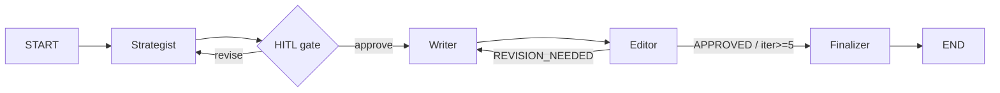

# content-creator-agent

A multi-agent system that plans, writes, and edits blog posts and social media content before saving the final approved result. Built with LangGraph, LangChain, and Bun in TypeScript.

## Architecture



**Pattern:** Prompt Chaining (Strategist → HITL → Writer) + Evaluator-Optimizer loop (Writer ↔ Editor), capped at 5 iterations.

## Agents

| Agent | Role | Tools | Structured output |
|---|---|---|---|
| **Strategist** | Researches topic, produces content plan | `web_search`, `brand_style_lookup` (RAG) | `ContentPlan` |
| **Writer** | Writes full draft from approved plan | `web_search`, `save_content` | `DraftContent` |
| **Editor** | Scores draft, returns actionable feedback | — | `EditFeedback` |

### Structured output contracts

```ts
ContentPlan   { outline, keywords, key_messages, target_audience, tone }
DraftContent  { content, word_count, keywords_used }
EditFeedback  { verdict: "APPROVED"|"REVISION_NEEDED", issues, tone_score, accuracy_score, structure_score }
```

## Setup

**1. Install dependencies**

```bash
bun install
```

**2. Configure environment**

```bash
cp .env.example .env
```

Edit `.env`:

```
OPENAI_API_KEY=sk-...
OPENAI_MODEL=gpt-4o-mini        # optional, defaults to gpt-4o-mini

# Langfuse observability (optional — leave blank to disable)
LANGFUSE_SECRET_KEY=
LANGFUSE_PUBLIC_KEY=
LANGFUSE_HOST=https://cloud.langfuse.com
```

**3. Seed the RAG corpus** (already included)

Brand docs live in `data/brand/` — `brand.md`, `style_guide.md`, and 7 example posts. The Strategist retrieves from these on every run. To use your own brand, replace the files there.

## Run

### CLI

```bash
bun run start -- \
  --topic "AI in accounting" \
  --channel blog \
  --tone professional \
  --audience "SMB owners" \
  --word-count 1200
```

Options:

| Flag | Values | Required |
|---|---|---|
| `--topic` | any string | yes |
| `--channel` | `blog` / `linkedin` / `twitter` | yes |
| `--tone` | any string | yes |
| `--audience` | any string | yes |
| `--word-count` | integer | yes |
| `--verbose` | flag | no |

### LangGraph Studio

```bash
bun run studio
```

Opens the graph in Studio at `http://localhost:8123`. Submit a brief as the initial state to step through nodes visually.

## HITL behavior

After the Strategist produces a `ContentPlan`, the graph pauses with an interrupt payload:

```json
{
  "kind": "plan_approval",
  "plan": { "outline": [...], "keywords": [...], ... },
  "brief": { "topic": "...", ... },
  "instructions": "Respond with { approved: true } to proceed, or { approved: false, feedback: '...' } to revise."
}
```

The CLI prompts:

```
[a]pprove, [r]evise, [q]uit?
```

- **a** — proceeds to Writer with the current plan
- **r** — prompts for feedback text, sends plan back to Strategist for revision (no iteration cap on HITL)
- **q** — exits and prints the thread ID for later debugging

Resume format (for programmatic use):
```ts
graph.stream(new Command({ resume: { approved: true } }), config)
graph.stream(new Command({ resume: { approved: false, feedback: "..." } }), config)
```

## Observability

Traces are sent to [Langfuse](https://cloud.langfuse.com) when `LANGFUSE_SECRET_KEY` and `LANGFUSE_PUBLIC_KEY` are set. Each LLM call is tagged with the agent name, iteration number, and thread ID.

Each node emits a named run:

| Node | `runName` | Tags |
|---|---|---|
| Strategist | `strategist` / `strategist-revision` | `strategist`, `initial`/`revision` |
| Writer | `writer-iter-N` | `writer`, `iteration:N` |
| Editor | `editor-iter-N` | `editor`, `iteration:N` |

To capture traces, add screenshots to `docs/traces/` after a run.

## Tests

```bash
bun run test:judge
```

Runs four LLM-as-a-Judge test files:

| File | What it tests | Assertions |
|---|---|---|
| `strategist.test.ts` | Plan matches brief (3 channels) | judge `pass === true` |
| `writer.test.ts` | Draft covers outline + keywords | keyword coverage ≥ 75%, judge `pass === true` |
| `editor.test.ts` | Editor rejects a bad draft | `REVISION_NEEDED`, `issues ≥ 3`, low scores |
| `e2e.test.ts` | Full pipeline from brief to approved content | judge `pass === true` |

Override the judge model:

```bash
TEST_MODEL=gpt-4o bun run test:judge
```

**Estimated cost per full suite run:** ~$0.05–0.20 with `gpt-4o-mini`.

Save results before submission:

```bash
bun run test:judge 2>&1 | tee tests/results/latest.txt
```

## Project structure

```
src/
  graph.ts          — compiled StateGraph with MemorySaver checkpointer
  state.ts          — Annotation.Root channels
  schemas.ts        — Zod contracts (ContentPlan, DraftContent, EditFeedback)
  model.ts          — shared ChatOpenAI instance
  constants.ts      — MAX_ITERATIONS = 5
  observability.ts  — Langfuse CallbackHandler singleton
  nodes/            — strategist, writer, editor, hitl, finalizer
  prompts/          — system prompts and message builders
  routing/          — editorRoute (REVISION_NEEDED → writer, else → finalizer)
  tools/            — web_search, brand_style_lookup (RAG), save_content
data/
  brand/            — style_guide.md, brand.md, examples/ (RAG corpus)
tests/
  judge/            — LLM-as-a-Judge test files + shared schema
  fixtures/         — briefs.ts, plans.ts, bad-draft.md
output/             — approved articles written by the pipeline
```

## Limits

- **Iteration cap:** Editor loop runs at most 5 times. If the draft is still `REVISION_NEEDED` at iteration 5, it is saved to `output/` with an `-unapproved` suffix alongside a `.review.md` sidecar with the final issues.
- **HITL:** No cap on plan revisions — the user controls this loop.
- **RAG:** Uses in-memory vector store (`MemoryVectorStore`) — embeddings are rebuilt on each process start. Swap to Chroma or Postgres for persistence.
- **Checkpointer:** Uses `MemorySaver` (in-process). Threads do not survive process restart. Swap to `SqliteSaver` for persistence across runs.
- **Search:** DuckDuckGo, max 5 results per call. No retry or rate-limit handling.
