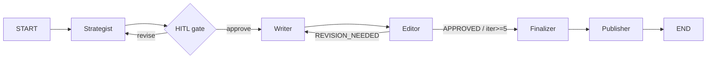

# content-creator-agent

A multi-agent system that plans, writes, and edits blog posts and social media content before saving the final approved result. Built with LangGraph, LangChain, and Bun in TypeScript.

## Architecture



**Pattern:** Prompt Chaining (Strategist → HITL → Writer) + Evaluator-Optimizer loop (Writer ↔ Editor), capped at 5 iterations.

## Agents

| Agent | Role | Tools | Structured output |
|---|---|---|---|
| **Strategist** | Researches topic, produces content plan | `web_search`, `brand_style_lookup` (RAG) | `ContentPlan` |
| **Writer** | Writes full draft from approved plan | `web_search` | `DraftContent` |
| **Editor** | Scores draft, returns actionable feedback | — | `EditFeedback` |

### Structured output contracts

```ts
ContentPlan   { outline, keywords, key_messages, target_audience, tone }
DraftContent  { content, word_count, keywords_used }
EditFeedback  { verdict: "APPROVED"|"REVISION_NEEDED", issues, tone_score, accuracy_score, structure_score }
```

## Setup

**1. Install dependencies**

```bash
bun install
```

**2. Configure environment**

```bash
cp .env.example .env
```

Edit `.env`:

```
OPENAI_API_KEY=sk-...
OPENAI_MODEL=gpt-4o-mini        # optional, defaults to gpt-4o-mini

# Langfuse observability (optional — leave blank to disable)
LANGFUSE_SECRET_KEY=
LANGFUSE_PUBLIC_KEY=
LANGFUSE_HOST=https://cloud.langfuse.com
LANGFUSE_PROMPT_PREFIX=content-creator-agent
LANGFUSE_PROMPT_LABEL=production

# Chroma vector store
CHROMA_URL=http://localhost:8000
CHROMA_COLLECTION=brand

# Notion MCP integration (optional — falls back to local files if unset)
NOTION_TOKEN=
NOTION_BRAND_PAGE_ID=
NOTION_DRAFTS_DATABASE_ID=
```

**3. Start Chroma**

The brand RAG corpus is stored in [Chroma](https://www.trychroma.com/). Run it locally with Docker:

```bash
docker run -d -p 8000:8000 --name chroma chromadb/chroma
```

The collection (`brand` by default) is created and indexed automatically on first run. Later runs reuse the saved collection unless you explicitly refresh it with `bun run reindex`.

**4. Brand source: Notion (recommended) or local files**

The Strategist queries a vector store built from your brand assets. There are two sources:

- **Notion (recommended)** — set `NOTION_TOKEN` and `NOTION_BRAND_PAGE_ID`. Create an integration at [notion.so/profile/integrations](https://www.notion.so/profile/integrations), share the parent brand page with it, and the agent will fetch all child pages via the [Notion MCP server](https://github.com/makenotion/notion-mcp-server) when the Chroma collection needs to be built or explicitly refreshed.
- **Local files (fallback)** — if Notion is unset or unreachable, the agent reads `data/brand/*.md` from disk. The repo ships with a sample corpus describing **Lumen**, a fictional AI development agency that builds custom LLM apps for small businesses. All brand content and example posts are written in Ukrainian.

**5. Notion drafts database (optional, for publishing)**

To auto-publish each finalized draft to Notion, create a database with these properties and share it with the integration, then set `NOTION_DRAFTS_DATABASE_ID`:

| Property | Type |
|---|---|
| `Name` | Title |
| `Channel` | Select |
| `Word Count` | Number |
| `Status` | Select (with options `Approved`, `Unapproved`) |

If `NOTION_DRAFTS_DATABASE_ID` is unset, the publisher node is a no-op.

## Run

### CLI

```bash
bun run start -- \
  --topic "Як LLM-асистент замінив менеджера підтримки" \
  --channel blog \
  --tone accessible \
  --audience "власники малого бізнесу" \
  --word-count 1200
```

Options:

| Flag | Values | Required |
|---|---|---|
| `--topic` | any string | yes |
| `--channel` | `blog` / `linkedin` / `twitter` / `instagram` / `threads` | yes |
| `--tone` | any string | yes |
| `--audience` | any string | yes |
| `--word-count` | integer | yes |
| `--verbose` | flag | no |

More examples:

**LinkedIn post:**
```bash
bun run start -- \
  --topic "Чому малий бізнес програє без автоматизації підтримки" \
  --channel linkedin \
  --tone professional \
  --audience "підприємці" \
  --word-count 300
```

**Instagram caption:**
```bash
bun run start -- \
  --topic "5 ознак що вашому бізнесу потрібен AI-асистент" \
  --channel instagram \
  --tone friendly \
  --audience "власники малого бізнесу" \
  --word-count 150
```

**With verbose output** (shows tool calls, editor scores, issues):
```bash
bun run start -- \
  --topic "Автоматизація онбордингу клієнтів через LLM" \
  --channel blog \
  --tone accessible \
  --audience "стартапери" \
  --word-count 800 \
  --verbose
```

### LangGraph Studio

```bash
bun run studio
```

Opens the graph in Studio at `http://localhost:8123`. Submit a brief as the initial state to step through nodes visually.

## HITL behavior

After the Strategist produces a `ContentPlan`, the graph pauses with an interrupt payload:

```json
{
  "kind": "plan_approval",
  "plan": { "outline": [...], "keywords": [...], ... },
  "brief": { "topic": "...", ... },
  "instructions": "Respond with { approved: true } to proceed, or { approved: false, feedback: '...' } to revise."
}
```

The CLI prompts:

```
[a]pprove, [r]evise, [q]uit?
```

- **a** — proceeds to Writer with the current plan
- **r** — prompts for feedback text, sends plan back to Strategist for revision (no iteration cap on HITL)
- **q** — exits and prints the thread ID for later debugging

Resume format (for programmatic use):
```ts
graph.stream(new Command({ resume: { approved: true } }), config)
graph.stream(new Command({ resume: { approved: false, feedback: "..." } }), config)
```

## Observability

Traces are sent to [Langfuse](https://cloud.langfuse.com) when `LANGFUSE_SECRET_KEY` and `LANGFUSE_PUBLIC_KEY` are set. Each LLM call is tagged with the agent name, iteration number, and thread ID.

Upload the local strategist, writer, and editor prompts to Langfuse Prompt Management:

```bash
bun run upload-prompts
```

By default this writes prompt versions named `content-creator-agent/strategist`, `content-creator-agent/writer`, and `content-creator-agent/editor` with the `production` label. Override with `LANGFUSE_PROMPT_PREFIX` or `LANGFUSE_PROMPT_LABEL` if needed.

At runtime, the Strategist, Writer, and Editor fetch their chat prompts from Langfuse using that prefix and label. If Langfuse is not configured or temporarily unavailable, the local prompts in `src/prompts/` are used as fallbacks.

Each node emits a named run:

| Node | `runName` | Tags |
|---|---|---|
| Strategist | `strategist` / `strategist-revision` | `strategist`, `initial`/`revision` |
| Writer | `writer-iter-N` | `writer`, `iteration:N` |
| Editor | `editor-iter-N` | `editor`, `iteration:N` |

To capture traces, add screenshots to `docs/traces/` after a run.

## Tests

```bash
bun run test:judge
```

Runs four LLM-as-a-Judge test files:

| File | What it tests | Assertions |
|---|---|---|
| `strategist.test.ts` | Plan matches brief (3 channels) | judge `pass === true` |
| `writer.test.ts` | Draft covers outline + keywords | keyword coverage ≥ 75%, judge `pass === true` |
| `editor.test.ts` | Editor rejects a bad draft | `REVISION_NEEDED`, `issues ≥ 3`, low scores |
| `e2e.test.ts` | Full pipeline from brief to approved content | judge `pass === true` |

Override the judge model:

```bash
TEST_MODEL=gpt-4o bun run test:judge
```

**Estimated cost per full suite run:** ~$0.05–0.20 with `gpt-4o-mini`.

Save results before submission:

```bash
bun run test:judge 2>&1 | tee tests/results/latest.txt
```

## Project structure

```
src/
  graph.ts          — compiled StateGraph with MemorySaver checkpointer
  state.ts          — Annotation.Root channels
  schemas.ts        — Zod contracts (ContentPlan, DraftContent, EditFeedback)
  model.ts          — shared ChatOpenAI instance
  constants.ts      — MAX_ITERATIONS = 5
  observability.ts  — Langfuse CallbackHandler singleton
  nodes/            — strategist, writer, editor, hitl, finalizer
  prompts/          — system prompts and message builders
  routing/          — editorRoute (REVISION_NEEDED → writer, else → finalizer)
  tools/            — web_search (with retry), brand_style_lookup (Chroma RAG), save_content
  mcp/              — Notion MCP client + brand fetch / publish helpers
scripts/
  reindex.ts        — force-rebuild the Chroma collection from the brand corpus
data/
  brand/            — fallback brand corpus (used if Notion is unset)
tests/
  judge/            — LLM-as-a-Judge test files + shared schema
  fixtures/         — briefs.ts, plans.ts, bad-draft.md
output/             — approved articles written by the pipeline
```

## Reliability

- **Null-state guards:** `editor`, `writer`, `strategist`, and `finalizer` throw clear errors if upstream state (plan/draft/structuredResponse) is missing — silent failures are no longer possible.
- **Search retries:** `web_search` retries on DuckDuckGo rate-limit errors with exponential backoff (2s, 4s, 6s) before giving up.
- **RAG error context:** brand corpus file-read failures name the exact file that broke.
- **Filename slug:** Unicode-aware (`\p{L}\p{N}`) so Ukrainian and other non-Latin topics produce real filenames; falls back to `content-<timestamp>` only if the slug is genuinely empty.
- **Editor scoring rubric:** explicit 0.0–0.3 / 0.4–0.7 / 0.8–1.0 bands per dimension instead of vague descriptions, for more consistent verdicts.

## Limits

- **Iteration cap:** Editor loop runs at most 5 times. If the draft is still `REVISION_NEEDED` at iteration 5, it is saved to `output/` with an `-unapproved` suffix alongside a `.review.md` sidecar with the final issues.
- **HITL:** No cap on plan revisions — the user controls this loop.
- **RAG:** Uses Chroma (local Docker, default `http://localhost:8000`). Embeddings persist between runs; a non-empty collection with a saved source hash is reused without loading Notion. Run `bun run reindex` to refresh the source corpus and rebuild the collection.
- **Checkpointer:** Uses `MemorySaver` (in-process). Threads do not survive process restart. Swap to `SqliteSaver` or `@langchain/langgraph-checkpoint-postgres` for persistence across runs.
- **Search:** DuckDuckGo, max 5 results per call. Rate-limit retries only; non-rate-limit errors are not retried.
- **Publisher:** Best-effort — if the Notion API call fails, the run does not error. Output is still saved to `./output/`.
