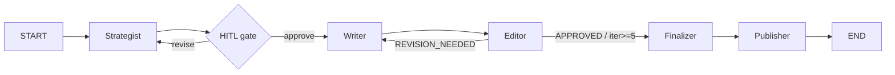
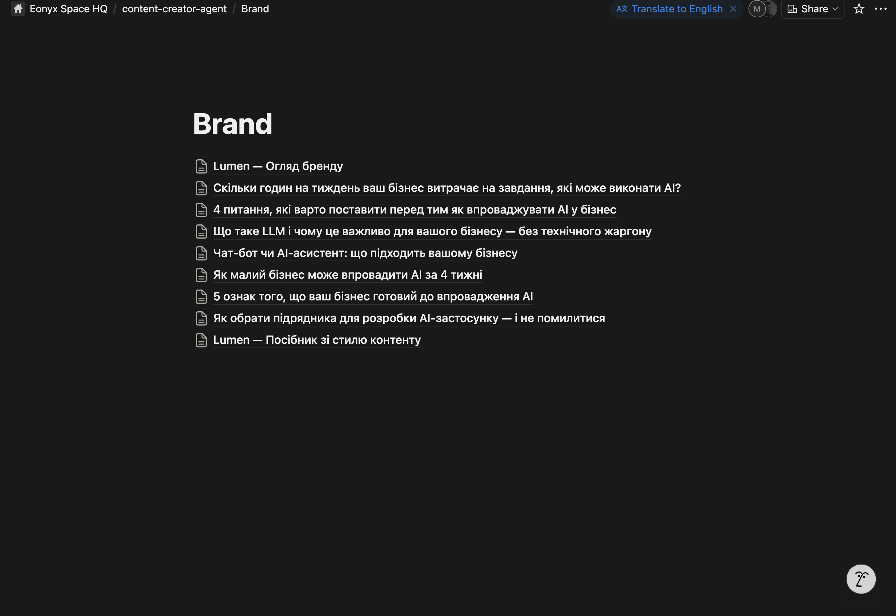
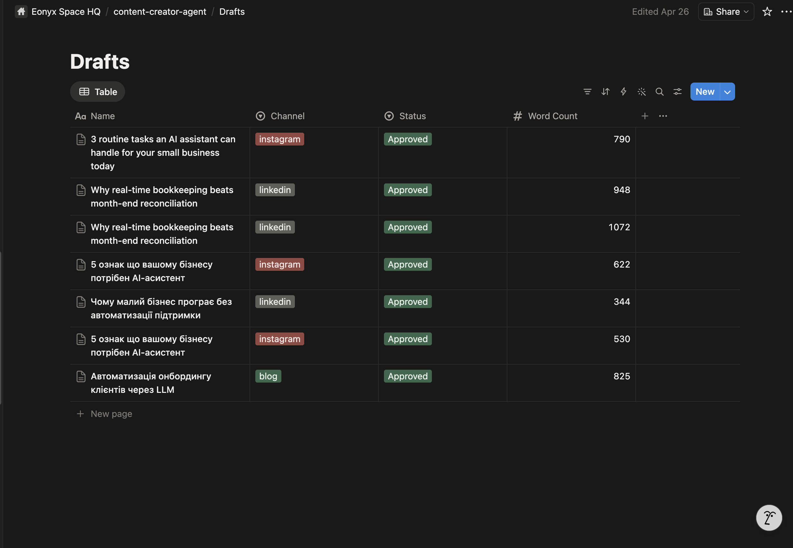
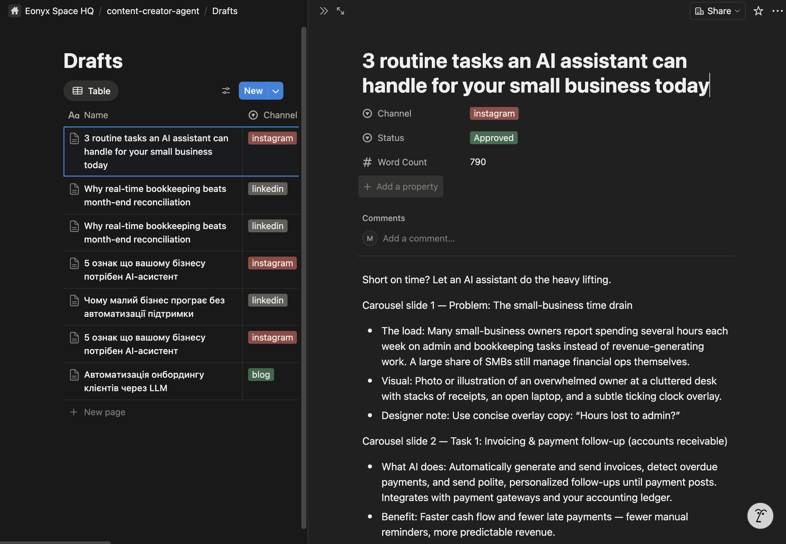
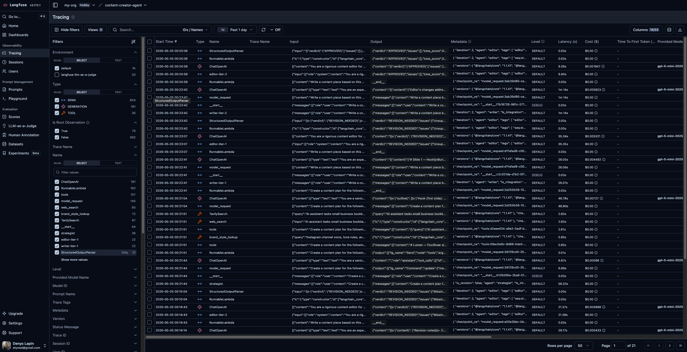
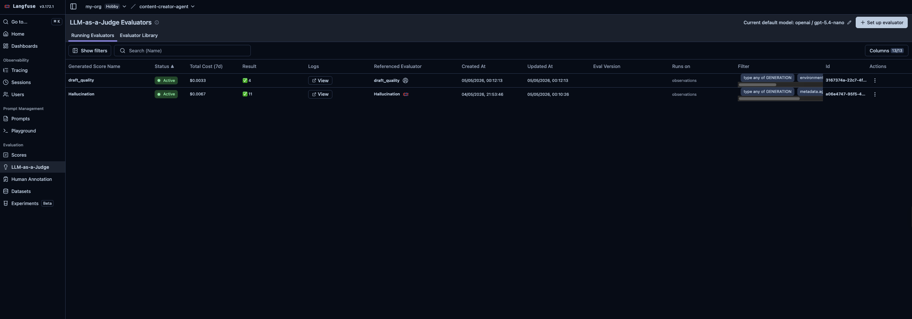
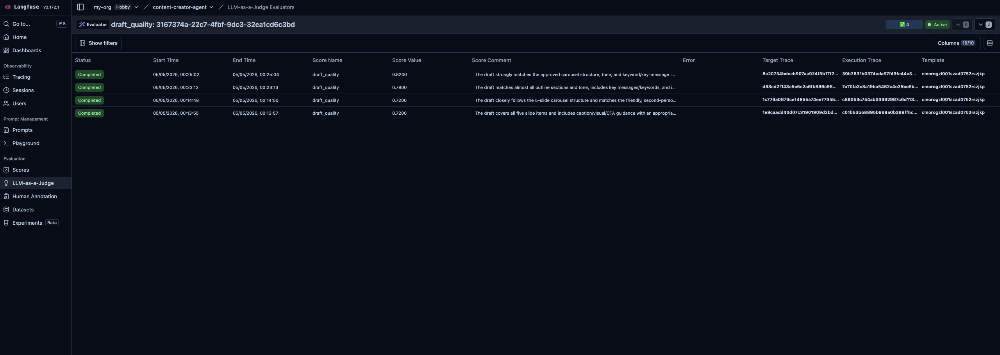
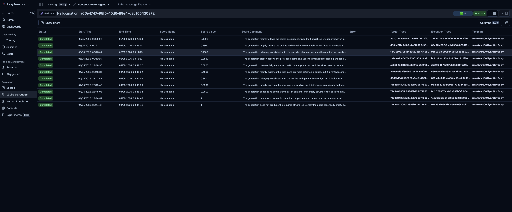
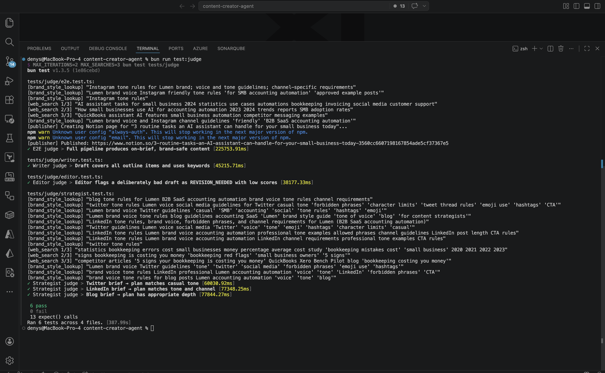

# content-creator-agent

A multi-agent system that plans, writes, and edits blog posts and social media content before saving the final approved result to a local drafts database (and optionally Notion). Built with LangGraph, LangChain, and Bun in TypeScript.

## Demo

[Video example](https://drive.google.com/file/d/1162yC6XOtEMKJW5yVBMNC32W54ng44OP/view?usp=sharing)

## Architecture


```mermaid
flowchart LR
    START --> Strategist
    Strategist --> HITL{HITL gate}
    HITL -- revise --> Strategist
    HITL -- approve --> Writer
    Writer --> Editor
    Editor -- REVISION_NEEDED --> Writer
    Editor -- APPROVED / iter>=5 --> Finalizer
    Finalizer --> Publisher
    Publisher --> END
```

**Pattern:** Prompt Chaining (Strategist → HITL → Writer) + Evaluator-Optimizer loop (Writer ↔ Editor), capped at 5 iterations.

## Agents

| Agent | Role | Tools | Structured output |
|---|---|---|---|
| **Strategist** | Researches topic, produces content plan | `web_search`, `brand_style_lookup` (RAG) | `ContentPlan` |
| **Writer** | Writes full draft from approved plan | `web_search` | `DraftContent` |
| **Editor** | Scores draft, returns actionable feedback | — | `EditFeedback` |

### Structured output contracts

```ts
ContentPlan   { outline, keywords, key_messages, target_audience, tone }
DraftContent  { content, word_count, keywords_used }
EditFeedback  { verdict: "APPROVED"|"REVISION_NEEDED", issues, tone_score, accuracy_score, structure_score }
```

## Setup

**1. Install dependencies**

```bash
bun install
```

**2. Configure environment**

```bash
cp .env.example .env
```

Edit `.env`:

```
OPENAI_API_KEY=sk-...
OPENAI_MODEL=gpt-4o-mini        # optional, defaults to gpt-4o-mini

# Tavily search API — get a free key at https://app.tavily.com
TAVILY_API_KEY=tvly-...

# Langfuse observability (optional — leave blank to disable)
LANGFUSE_SECRET_KEY=
LANGFUSE_PUBLIC_KEY=
LANGFUSE_BASE_URL=https://cloud.langfuse.com

# Chroma vector store
CHROMA_URL=http://localhost:8000
CHROMA_COLLECTION=brand

# Notion MCP integration (optional — falls back to local files if unset)
NOTION_TOKEN=
NOTION_BRAND_PAGE_ID=
NOTION_DRAFTS_DATABASE_ID=

# Set to "true" to skip the Notion publish step
SKIP_PUBLISH=
```

**3. Start Chroma**

The brand RAG corpus is stored in [Chroma](https://www.trychroma.com/). Run it locally with Docker:

```bash
docker run -d -p 8000:8000 --name chroma chromadb/chroma
```

The collection (`brand` by default) is created and indexed automatically on first run. Later runs reuse the saved collection unless you explicitly refresh it with `bun run reindex`.

**4. Brand source: Notion (recommended) or local files**

The Strategist queries a vector store built from your brand assets. There are two sources:

- **Notion (recommended)** — set `NOTION_TOKEN` and `NOTION_BRAND_PAGE_ID`. Create an integration at [notion.so/profile/integrations](https://www.notion.so/profile/integrations), share the parent brand page with it, and the agent will fetch all child pages via the [Notion MCP server](https://github.com/makenotion/notion-mcp-server) when the Chroma collection needs to be built or explicitly refreshed.
- **Local files (fallback)** — if Notion is unset or unreachable, the agent reads `data/brand/*.md` from disk. The repo ships with a sample corpus describing **EONYX**, a fictional AI development agency that builds custom LLM apps for small businesses. All brand content and example posts are written in Ukrainian.



**5. Notion drafts database (optional, for publishing)**

To auto-publish each finalized draft to Notion, create a database with these properties and share it with the integration, then set `NOTION_DRAFTS_DATABASE_ID`:

| Property | Type |
|---|---|
| `Name` | Title |
| `Channel` | Select |
| `Word Count` | Number |
| `Status` | Select (with options `Approved`, `Unapproved`) |

If `NOTION_DRAFTS_DATABASE_ID` is unset, the publisher node is a no-op.





## Run

### CLI

```bash
bun run start -- \
  --topic "Як LLM-асистент замінив менеджера підтримки" \
  --channel blog \
  --tone accessible \
  --audience "власники малого бізнесу" \
  --word-count 1200
```

Options:

| Flag | Values | Required |
|---|---|---|
| `--topic` | any string | yes |
| `--channel` | `blog` / `linkedin` / `twitter` / `instagram` / `threads` | yes |
| `--tone` | any string | yes |
| `--audience` | any string | yes |
| `--word-count` | integer | yes |
| `--verbose` | flag | no |

Each run prints token usage and estimated cost at the end — configure costs via `PRICE_INPUT_PER_1M` / `PRICE_OUTPUT_PER_1M`.

More examples:

**LinkedIn post:**
```bash
bun run start -- \
  --topic "Чому малий бізнес програє без автоматизації підтримки" \
  --channel linkedin \
  --tone professional \
  --audience "підприємці" \
  --word-count 300
```

**Instagram caption:**
```bash
bun run start -- \
  --topic "5 ознак що вашому бізнесу потрібен AI-асистент" \
  --channel instagram \
  --tone friendly \
  --audience "власники малого бізнесу" \
  --word-count 150
```

**With verbose output** (shows tool calls, editor scores, issues):
```bash
bun run start -- \
  --topic "Автоматизація онбордингу клієнтів через LLM" \
  --channel blog \
  --tone accessible \
  --audience "стартапери" \
  --word-count 800 \
  --verbose
```

### LangGraph Studio

```bash
bun run studio
```

Opens the graph in Studio at `http://localhost:8123`. Submit a brief as the initial state to step through nodes visually.

### Dashboard & API

```bash
bun run dev:all
```

Starts the Hono API on `:3000` and the Next.js dashboard on `http://localhost:3001`. Four screens:

| Route | What it does |
|---|---|
| `/` | Stat tiles, spend-over-time and drafts-per-channel charts, recent drafts |
| `/run` | Submit a brief, watch the pipeline live, approve or revise the plan |
| `/drafts` | Every draft ever generated, with verdict, word count and cost |
| `/drafts/[id]` | Full content, editor scores and issues, publish to Notion |

The dashboard is frontend-only: it reaches the API exclusively through a `/api/*` rewrite, so the Hono server keeps owning the pipeline, SQLite and SSE.

**Visual identity.** The dashboard wears the [EONYX Design System](https://claude.ai/design), imported from Claude Design rather than reimplemented — its `tokens/*.css` were pulled with the `DesignSync` tool's read methods (`get_project` → `list_files` → `get_file`) and mapped onto shadcn's semantic variables in `web/app/globals.css`, and the wordmark is ported verbatim from the system's own `Logo` component. Dark-first near-black indigo with an electric-cyan accent, Montserrat + JetBrains Mono, angular flat surfaces. A toggle in the nav switches to the light register; the choice persists and applies before first paint.

**Auth.** Setting `DEMO_PASSWORD` puts a shared-password gate in front of everything (needed for any public deployment — an unguarded URL spends your OpenAI credits). Leaving it unset disables auth entirely, which is the local-dev default.

**No Chroma needed.** `VECTOR_STORE=memory` builds the brand corpus into an in-process vector store at startup instead of talking to Chroma — that's what the deployed container uses.

API endpoints (reachable directly on `:3000`, or via `/api/*` from the dashboard): `POST /runs`, `GET /runs/:id`, `POST /runs/:id/resume`, `GET /runs/:id/events` (SSE), `GET /drafts`, `GET /drafts/:id`, `POST /drafts/:id/publish`, `GET /stats`, `POST /auth/login`, `GET /auth/check`.

### Deploying

The app ships as a single container running both processes (`Dockerfile` + `docker-entrypoint.sh`), targeted at Fly.io:

```bash
fly launch --no-deploy --copy-config
fly volumes create demo_data --size 1
fly secrets set OPENAI_API_KEY=... TAVILY_API_KEY=... DEMO_PASSWORD=...
fly deploy && fly scale count 1
```

Two settings in `fly.toml` are load-bearing rather than cosmetic: `auto_stop_machines = false` and a single machine. Run state lives in an in-memory `Map` and a run pauses mid-flight waiting for human approval, so a stopped or duplicated machine loses in-flight runs. Verify by observation (`fly status` after an idle period), not by reading the config back.

Leave `NOTION_BRAND_PAGE_ID` unset in production — the brand corpus is baked into the image, and fetching it over the Notion MCP server spawns `npx` at startup.

## HITL behavior

After the Strategist produces a `ContentPlan`, the graph pauses with an interrupt payload:

```json
{
  "kind": "plan_approval",
  "plan": { "outline": [...], "keywords": [...], ... },
  "brief": { "topic": "...", ... },
  "instructions": "Respond with { approved: true } to proceed, or { approved: false, feedback: '...' } to revise."
}
```

The CLI prompts:

```
[a]pprove, [r]evise, [q]uit?
```

- **a** — proceeds to Writer with the current plan
- **r** — prompts for feedback text, sends plan back to Strategist for revision (no iteration cap on HITL)
- **q** — exits and prints the thread ID for later debugging

Resume format (for programmatic use):
```ts
graph.stream(new Command({ resume: { approved: true } }), config)
graph.stream(new Command({ resume: { approved: false, feedback: "..." } }), config)
```

## Observability

Traces are sent to [Langfuse](https://cloud.langfuse.com) when `LANGFUSE_SECRET_KEY` and `LANGFUSE_PUBLIC_KEY` are set.

Each CLI run maps to a single Langfuse **Session** (identified by the `thread_id` UUID printed at startup). All agent traces within that run are linked to the session, so you can view the complete `strategist → writer → editor` chain together in the Sessions view.

Each node emits a named run:

| Node | `runName` | Tags | Metadata |
|---|---|---|---|
| Strategist | `strategist` / `strategist-revision` | `strategist`, `initial`/`revision` | `agent`, `is_revision` |
| Writer | `writer-iter-N` | `writer`, `iteration:N` | `agent`, `iteration` |
| Editor | `editor-iter-N` | `editor`, `iteration:N` | `agent`, `iteration` |

All buffered events are flushed when the process exits cleanly. If Langfuse env vars are unset, the handler is a no-op and the pipeline runs without tracing.



### LLM-as-a-Judge evaluators

Online evaluators run automatically on each incoming observation. The project ships with two:

| Evaluator | Scores |
|---|---|
| `draft_quality` | Overall structure, tone, and instruction-following of each writer/editor generation |
| `Hallucination` | Detects factual inconsistencies in generated content |







Upload the local strategist, writer, and editor prompts to Langfuse Prompt Management:

```bash
bun run upload-prompts
```

By default this writes prompt versions named `content-creator-agent/strategist`, `content-creator-agent/writer`, and `content-creator-agent/editor` with the `production` label. Override with `LANGFUSE_PROMPT_PREFIX` or `LANGFUSE_PROMPT_LABEL` if needed.

At runtime, the Strategist, Writer, and Editor fetch their chat prompts from Langfuse using that prefix and label. If Langfuse is not configured or temporarily unavailable, the local prompts in `src/prompts/` are used as fallbacks.

## Tests

```bash
bun run test:unit
```

Fast, free unit tests — also run in CI. No external API calls.

```bash
bun run test:judge
```

Runs four LLM-as-a-Judge test files (judge tests remain manual):

| File | What it tests | Assertions |
|---|---|---|
| `strategist.test.ts` | Plan matches brief (3 channels) | judge `pass === true` |
| `writer.test.ts` | Draft covers outline + keywords | keyword coverage ≥ 75%, judge `pass === true` |
| `editor.test.ts` | Editor rejects a bad draft | `REVISION_NEEDED`, `issues ≥ 3`, low scores |
| `e2e.test.ts` | Full pipeline from brief to approved content | judge `pass === true` |

Override the judge model:

```bash
TEST_MODEL=gpt-4o bun run test:judge
```

**Estimated cost per full suite run:** ~$0.05–0.20 with `gpt-4o-mini`.



Save results before submission:

```bash
bun run test:judge 2>&1 | tee tests/results/latest.txt
```

## Project structure

```
src/
  graph.ts          — compiled StateGraph with MemorySaver checkpointer
  state.ts          — Annotation.Root channels
  schemas.ts        — Zod contracts (ContentPlan, DraftContent, EditFeedback)
  model.ts          — shared ChatOpenAI instance
  constants.ts      — MAX_ITERATIONS = 5
  observability.ts  — Langfuse CallbackHandler singleton
  nodes/            — strategist, writer, editor, hitl, finalizer
  prompts/          — system prompts and message builders
  routing/          — editorRoute (REVISION_NEEDED → writer, else → finalizer)
  tools/            — web_search (with retry), brand_style_lookup, memoryVectorStore
  mcp/              — Notion MCP client + brand fetch / publish helpers
  auth.ts           — shared-password gate (HMAC session token)
  db.ts             — SQLite drafts store + /stats aggregation
  server.ts         — Hono API (no static serving; the dashboard is separate)
  runManager.ts     — drives the graph for HTTP, SSE pub-sub, TTL sweep
  activity.ts       — per-run progress channel (tools/nodes → stdout + SSE)
  costTracker.ts    — token/cost accounting attached to every run
web/                — Next.js dashboard (own package.json, tsconfig, eslint)
  app/(dashboard)/  — /, /run, /drafts, /drafts/[id]
  app/globals.css   — EONYX tokens (dark :root + html.light) → shadcn vars
  components/       — logo, nav, theme-toggle, charts, badges; ui/ is shadcn
  app/login/        — password gate, outside the dashboard shell
  proxy.ts          — Next 16 route protection (was middleware.ts pre-16)
scripts/
  reindex.ts        — force-rebuild the Chroma collection from the brand corpus
data/
  brand/            — brand corpus (baked into the container image)
tests/
  unit/             — fast, free, deterministic; what CI runs
  judge/            — LLM-as-a-Judge test files + shared schema
  fixtures/         — briefs.ts, plans.ts, bad-draft.md
output/             — approved/unapproved articles as Markdown (when WRITE_OUTPUT_FILES=true)
Dockerfile          — single container running both the API and the dashboard
fly.toml            — Fly.io config (auto-stop disabled, single machine, volume)
```

## Reliability

- **Null-state guards:** `editor`, `writer`, `strategist`, and `finalizer` throw clear errors if upstream state (plan/draft/structuredResponse) is missing — silent failures are no longer possible.
- **Search retries:** `web_search` retries on Tavily errors with exponential backoff before giving up.
- **RAG error context:** brand corpus file-read failures name the exact file that broke.
- **Filename slug:** Unicode-aware (`\p{L}\p{N}`) so Ukrainian and other non-Latin topics produce real filenames; falls back to `content-<timestamp>` only if the slug is genuinely empty.
- **Editor scoring rubric:** explicit 0.0–0.3 / 0.4–0.7 / 0.8–1.0 bands per dimension instead of vague descriptions, for more consistent verdicts.

## Limits

- **Iteration cap:** Editor loop runs at most 5 times (`MAX_ITERATIONS = 5`). If the draft is still `REVISION_NEEDED` at iteration 5, it is saved to the SQLite database with a `review` field containing the final issues. Set `WRITE_OUTPUT_FILES=true` to also write unapproved drafts as Markdown files under `output/`.
- **HITL:** No cap on plan revisions — the user controls this loop.
- **RAG:** Uses Chroma (local Docker, default `http://localhost:8000`). Embeddings persist between runs; a non-empty collection with a saved source hash is reused without loading Notion. Run `bun run reindex` to refresh the source corpus and rebuild the collection.
- **Checkpointer:** Uses `MemorySaver` (in-process). Threads do not survive process restart. Swap to `SqliteSaver` or `@langchain/langgraph-checkpoint-postgres` for persistence across runs.
- **Search:** Tavily, max 5 results per call, capped at 10 searches per run. Requires `TAVILY_API_KEY`.
- **Publisher:** optional — drafts always persist to the SQLite database; the Notion publish runs only when `NOTION_TOKEN` and `NOTION_DRAFTS_DATABASE_ID` are set (or on demand via `POST /drafts/:id/publish` / the UI button). `SKIP_PUBLISH=true` disables the automatic graph publish.
- **Observability:** Trace events are buffered and flushed on clean process exit. Abrupt termination (SIGKILL, unhandled crash) may drop the last batch of events before they reach Langfuse.
